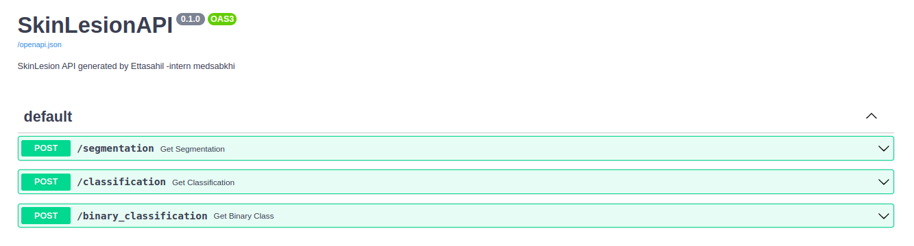
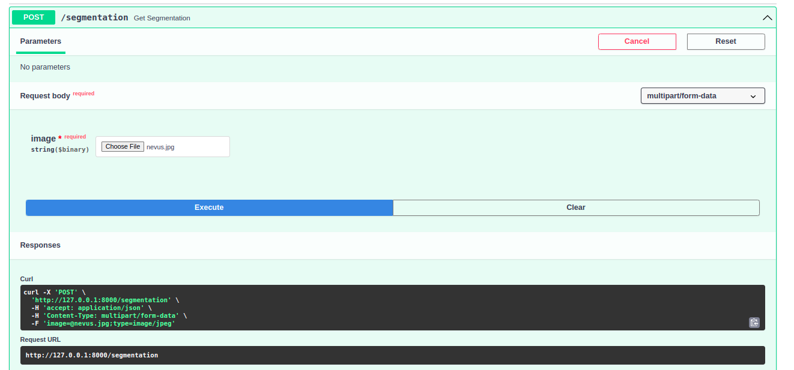
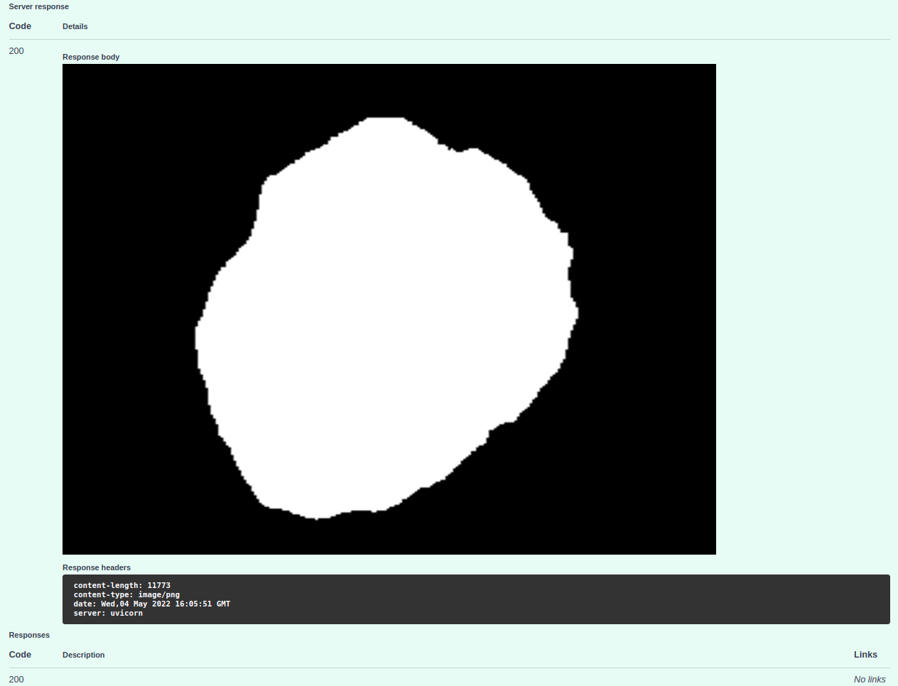
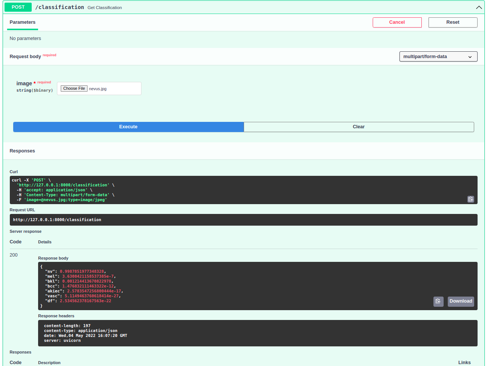
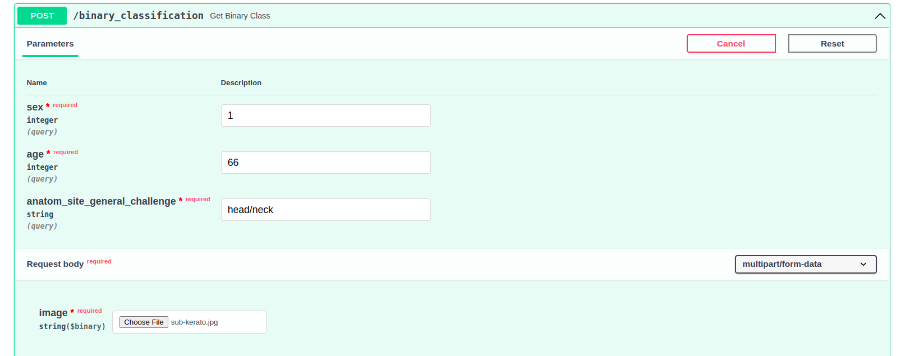
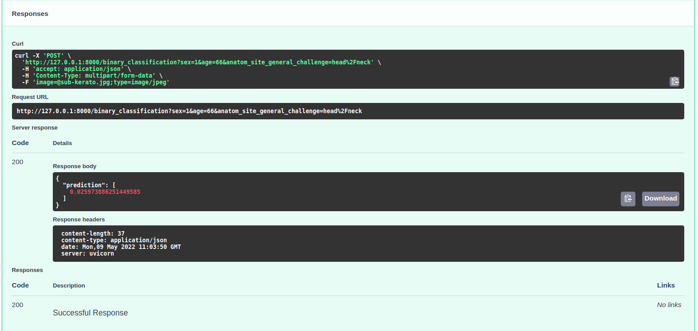
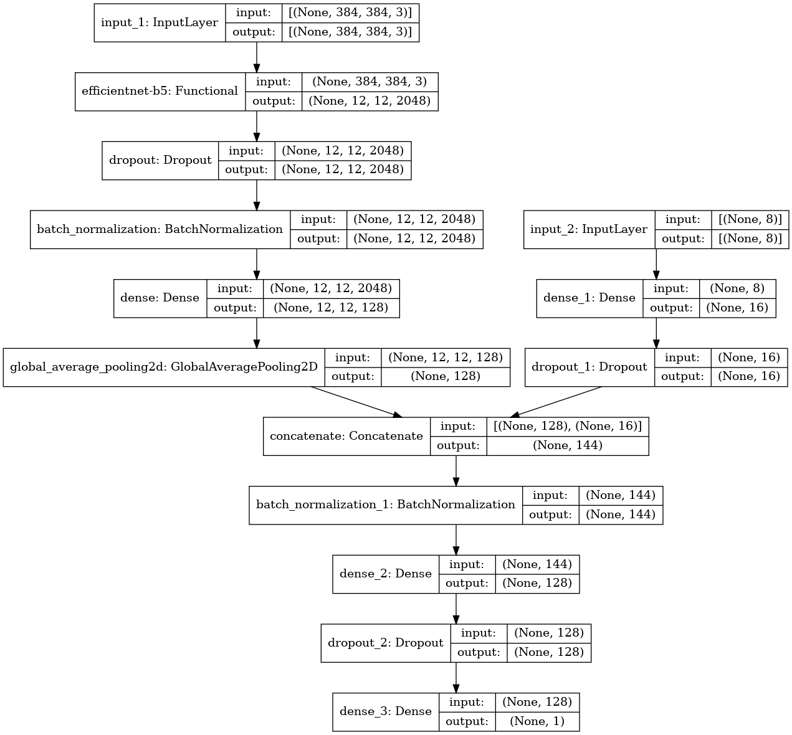
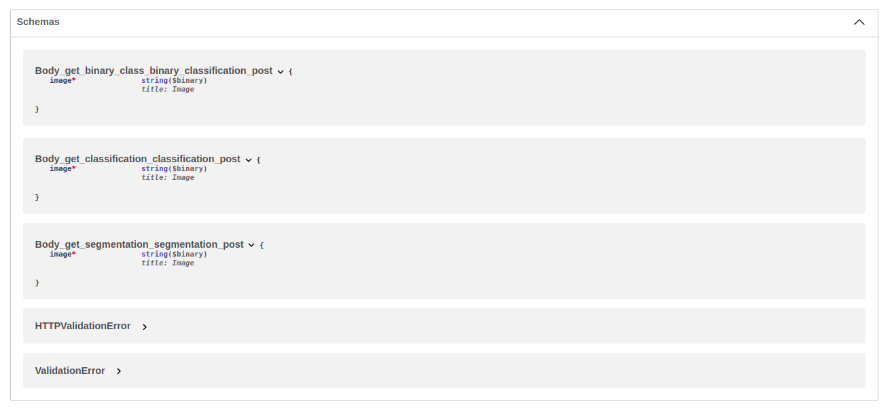

# SkinLesionAPI

## Installation Guide:

### create new env
`conda create -n newenv  python=3.8`

### activate env:
`conda activate newenv`

### install required packages:
`pip3 install  -r requirements.txt`
 
### download the models from [This Shared Google Drive Folder](https://drive.google.com/drive/folders/1O3JYpYKAS3rJmHCpfBxppWWDyr6nTjQv?usp=sharing) 

###create folder model/ under root directory
### put models in folder model/ 

### run server:
`uvicorn server:app`

### to restart server :
`uvicorn server:app  --reload`

The command uvicorn server:app refers to:

server: the file server.py (the Python "module").
app: the object created inside of server.py with the line app = FastAPI().
--reload: make the server restart after code changes. 

# How to Test the API:
 got to FastApi API [http://127.0.0.1:8000/docs](http://127.0.0.1:8000/docs) 

## Test Segmentation:

### Segmentation model architecture:

## Test Multiclass classification:

### Multiclass model architecture:

## Test Binary Classification:

### API collection:
-Sex: binary
 0:Male
 1:Female 

 -Age: int
 
-anatom_site: 'head/neck' ,'upper extremity','lower extremity', 'torso' , 'palms/soles', 'oral/genital'

### Binary Classification model Architecture:

## API Schemas: 

### Anaconda documentation:
https://docs.conda.io/projects/conda/en/latest/user-guide/index.html
### FastAPI documentation:
https://fastapi.tiangolo.com/
### Tensorflow 2.8 documentation:
https://www.tensorflow.org/api_docs/python/tf
## EfficientNet documentation:
https://pypi.org/project/efficientnet/
## Unet documentation:
https://u-net.readthedocs.io/en/latest/

